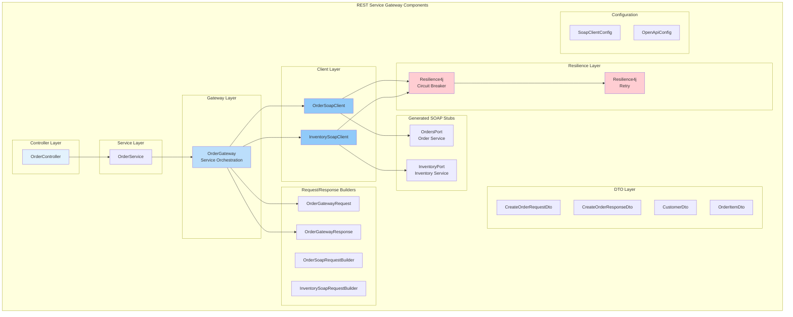
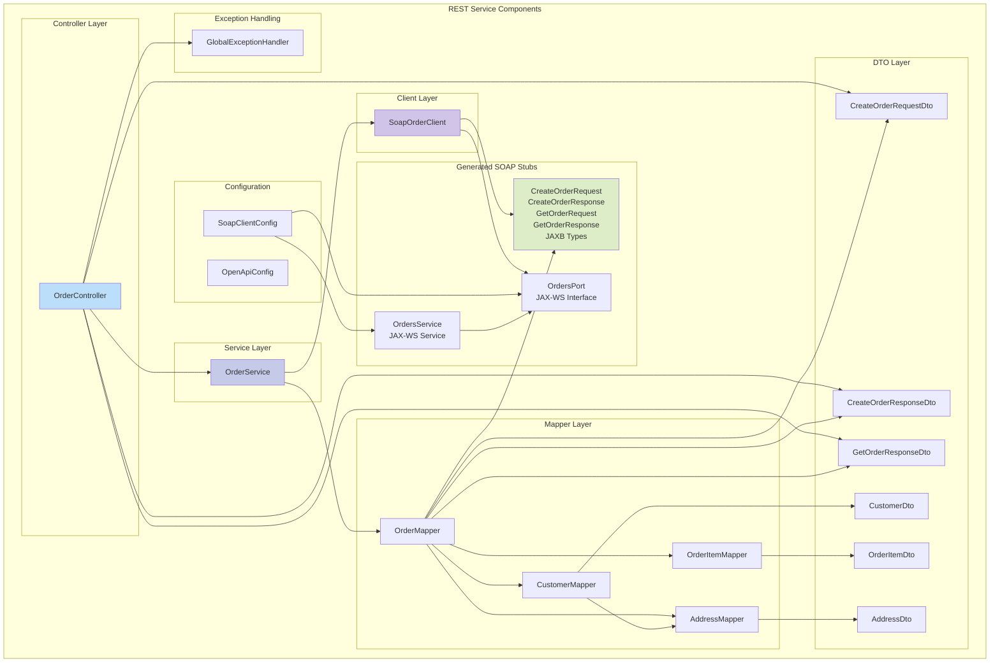
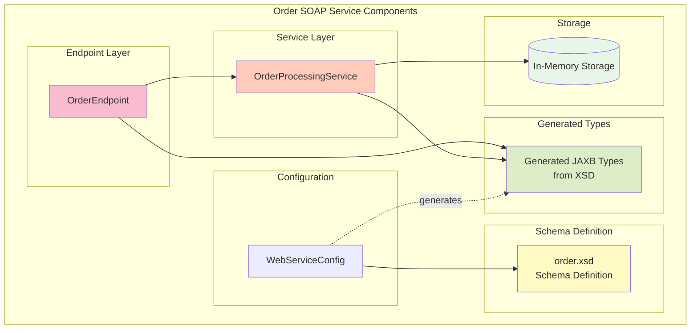
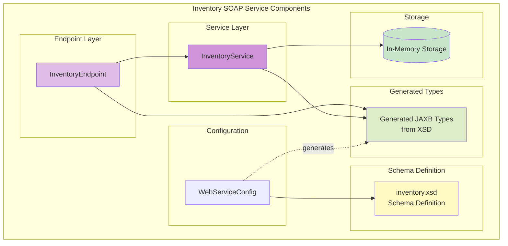

# Component Diagram

This diagram shows all the components in the system and their dependencies.

## REST Service Gateway Components

## REST Service Components (Simple)

## Order SOAP Service Components

## Inventory SOAP Service Components

## Component Relationships

### REST Service Gateway Components

#### Controller Layer
- **OrderController**: Entry point for REST API requests with inventory orchestration

#### Service Layer
- **OrderService**: Delegates to OrderGateway for multi-service orchestration

#### Gateway Layer
- **OrderGateway**: Orchestrates calls to Order SOAP and Inventory SOAP services

#### Client Layer
- **OrderSoapClient**: Communicates with Order SOAP service via JAX-WS
- **InventorySoapClient**: Communicates with Inventory SOAP service via JAX-WS

#### Resilience Layer
- **Resilience4j Circuit Breaker**: Protects against cascading failures
- **Resilience4j Retry**: Implements retry logic with exponential backoff

### REST Service Components (Simple)

#### Controller Layer
- **OrderController**: Entry point for REST API requests, handles HTTP concerns

#### Service Layer
- **OrderService**: Orchestrates business logic and coordinates mappers and SOAP client

#### Client Layer
- **SoapOrderClient**: Encapsulates SOAP communication using JAX-WS

#### Mapper Layer
- **OrderMapper**: Main mapper coordinating order conversion
- **CustomerMapper**: Converts customer information
- **OrderItemMapper**: Converts order item details
- **AddressMapper**: Converts address information

#### DTO Layer
- Contains REST-specific Data Transfer Objects for clean API contracts

#### Configuration
- **SoapClientConfig**: Configures JAX-WS client beans
- **OpenApiConfig**: Configures Swagger/OpenAPI documentation

#### Generated SOAP Stubs
- **OrdersPort**: Type-safe interface for SOAP operations
- **OrdersService**: JAX-WS service client
- **JAXB Types**: Generated from WSDL for type-safe SOAP communication

### Order SOAP Service Components

#### Endpoint Layer
- **OrderEndpoint**: Entry point for SOAP requests using @PayloadRoot

#### Service Layer
- **OrderProcessingService**: Business logic and data management

#### Configuration
- **WebServiceConfig**: Configures Spring WS and WSDL generation

#### Schema Definition
- **order.xsd**: XSD schema defining the service contract (source of truth)

#### Generated Types
- **JAXB Types**: Generated from XSD for marshalling/unmarshalling XML

### Inventory SOAP Service Components

#### Endpoint Layer
- **InventoryEndpoint**: Entry point for inventory SOAP requests

#### Service Layer
- **InventoryService**: Manages inventory checking and reservation

#### Operations
- **checkInventory**: Check product availability
- **reserveInventory**: Reserve inventory for an order

#### Configuration
- **WebServiceConfig**: Configures Spring WS and WSDL generation

#### Schema Definition
- **inventory.xsd**: XSD schema defining inventory service contract

## Key Design Patterns

1. **Separation of Concerns**: Clear layer separation (Controller, Service, Client)
2. **Dependency Injection**: Spring-managed beans with constructor injection
3. **Contract-First**: XSD defines the contract, code is generated
4. **Mapper Pattern**: MapStruct handles object conversion
5. **Facade Pattern**: Service layer provides a simplified interface
6. **Proxy Pattern**: JAX-WS generated proxies handle SOAP communication
7. **Gateway Pattern**: Orchestrates calls to multiple backend services
8. **Circuit Breaker Pattern**: Resilience4j protects against cascading failures
