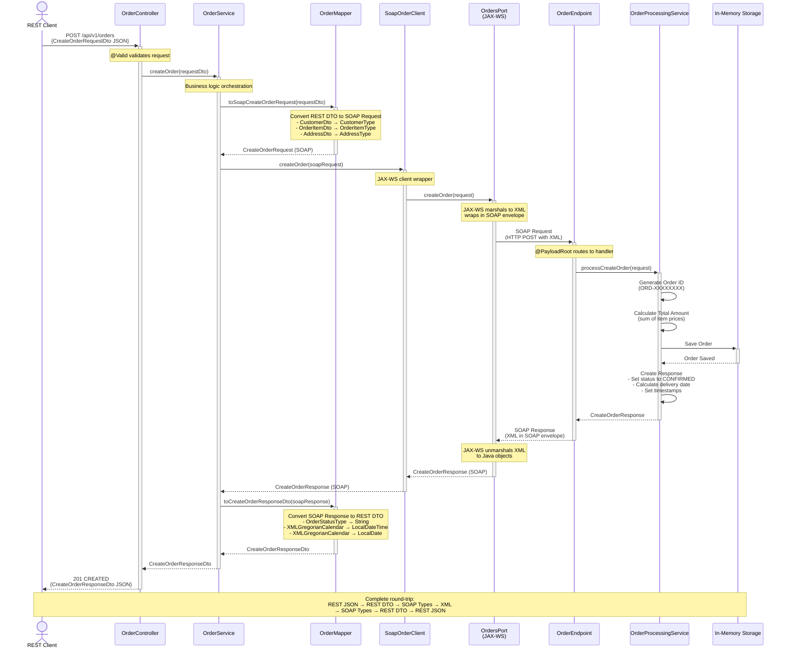

# Create Order Sequence Diagram

This diagram illustrates the complete flow when a client creates an order through the REST API.



## Flow Steps Explained

### 1. Client Request
- Client sends HTTP POST request with JSON payload containing order details
- Request includes customer information, items, notes, and priority flag

### 2. Controller Layer
- **OrderController** receives the request
- Jakarta Bean Validation (`@Valid`) validates the request DTO
- Delegates to **OrderService**

### 3. Service Layer
- **OrderService** orchestrates the transformation and communication
- Calls **OrderMapper** to convert REST DTO to SOAP request

### 4. Mapping Layer
- **OrderMapper** uses MapStruct to perform the conversion
- Nested objects are mapped using specialized mappers:
  - **CustomerMapper** for customer data
  - **OrderItemMapper** for order items
  - **AddressMapper** for address information
- Result is a fully populated SOAP `CreateOrderRequest`

### 5. SOAP Client
- **SoapOrderClient** wraps the JAX-WS client
- Calls the type-safe **OrdersPort** interface
- JAX-WS handles:
  - Marshalling Java objects to XML
  - Wrapping XML in SOAP envelope
  - HTTP communication

### 6. SOAP Service
- **OrderEndpoint** receives the SOAP request
- Routes to appropriate handler based on `@PayloadRoot`
- Delegates to **OrderProcessingService**

### 7. Business Logic
- **OrderProcessingService** processes the order:
  - Generates unique order ID
  - Calculates total amount from items
  - Stores order in memory (simulating database)
  - Creates response with:
    - Order status (CONFIRMED)
    - Total amount
    - Estimated delivery date
    - Timestamps

### 8. Response Flow
- Response flows back through the same layers in reverse
- JAX-WS unmarshals SOAP response to Java objects
- **OrderMapper** converts SOAP response to REST DTO
- **OrderController** returns 201 CREATED with JSON response

## Data Transformations

### Request Path
```
REST JSON → CreateOrderRequestDto → CreateOrderRequest (SOAP) → XML
```

### Response Path
```
XML → CreateOrderResponse (SOAP) → CreateOrderResponseDto → REST JSON
```

## Error Handling

- Validation errors caught by `@Valid` annotation
- SOAP faults handled by **GlobalExceptionHandler**
- Returns appropriate HTTP status codes and error responses
