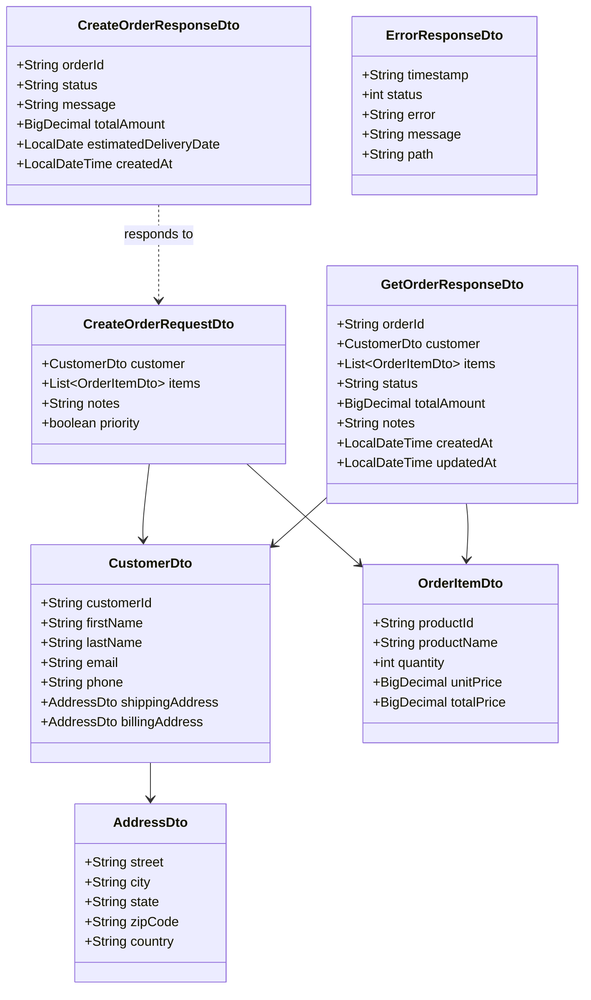
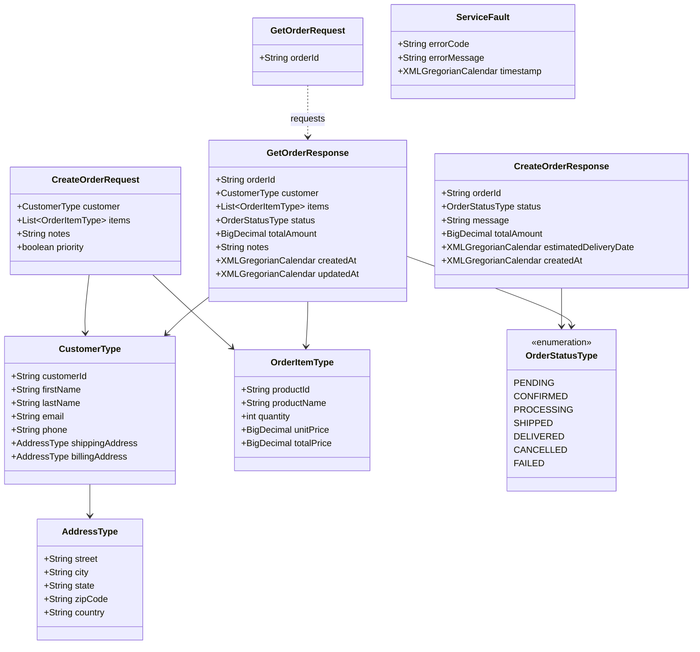
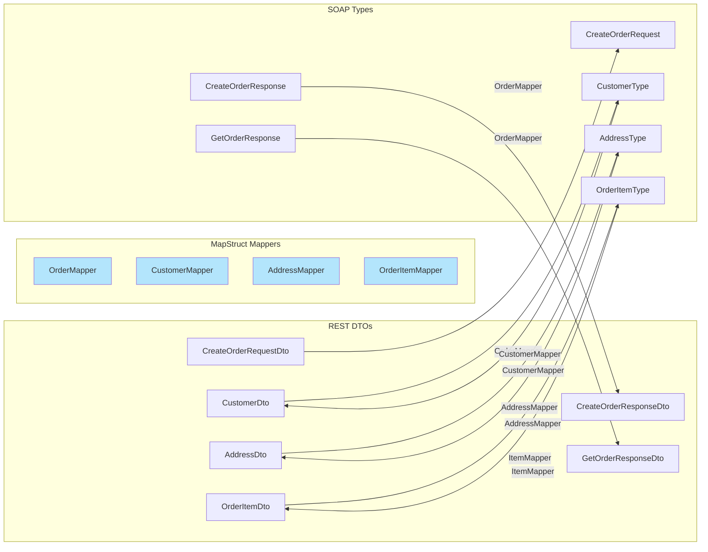
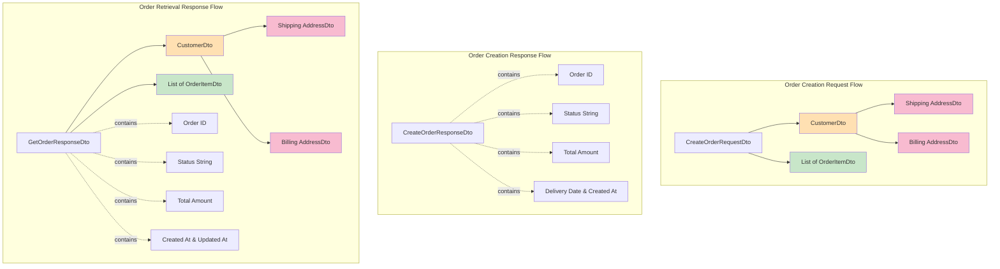

# Data Model Diagram

This diagram shows the domain objects, DTOs, and their relationships in both REST and SOAP layers.

## REST Layer DTOs

## SOAP Layer Types (Generated from XSD)

## Mapping Relationships

## Object Relationships and Compositions

## Key Data Model Features

### REST Layer (DTOs)
- **Clean Java 8 Types**: Uses `LocalDateTime`, `LocalDate`, `BigDecimal`
- **Jakarta Validation**: Annotated with `@Valid`, `@NotNull`, `@Email`, etc.
- **Lombok**: Uses `@Data`, `@Builder` for boilerplate reduction
- **Immutability Option**: Can use `@Value` for immutable DTOs
- **JSON Serialization**: Works seamlessly with Jackson

### SOAP Layer (Generated Types)
- **JAXB Annotated**: Auto-generated with `@XmlRootElement`, `@XmlType`, etc.
- **XML Types**: Uses `XMLGregorianCalendar` for dates
- **Enum Support**: `OrderStatusType` enum for type-safe status values
- **Contract-Driven**: Generated directly from XSD schema
- **Namespace Aware**: Includes XML namespace declarations

### Mapping Considerations

#### Type Conversions
- **Date/Time**: `XMLGregorianCalendar` ↔ `LocalDateTime` / `LocalDate`
- **Enums**: `OrderStatusType` ↔ `String`
- **Nested Objects**: Recursive mapping via specialized mappers
- **Collections**: `List<OrderItemType>` ↔ `List<OrderItemDto>`

#### Mapper Hierarchy
1. **OrderMapper**: Top-level mapper, uses other mappers
2. **CustomerMapper**: Handles customer data, uses AddressMapper
3. **AddressMapper**: Simple field-to-field mapping
4. **OrderItemMapper**: Handles order item conversion

#### Custom Mapping Methods
- `orderStatusToString()`: Converts enum to string
- `xmlCalendarToLocalDateTime()`: Converts XML datetime to Java 8 datetime
- `xmlCalendarToLocalDate()`: Converts XML date to Java 8 date

### Validation Rules

#### CreateOrderRequestDto
- Customer: Required, must be valid CustomerDto
- Items: Required, at least 1 item
- Each item: Valid product info, positive quantity and prices
- Notes: Optional
- Priority: Defaults to false

#### CustomerDto
- Customer ID: Required, non-empty
- First Name: Required
- Last Name: Required
- Email: Required, valid email format
- Phone: Optional
- Shipping Address: Required
- Billing Address: Optional (defaults to shipping if not provided)

#### AddressDto
- All fields required: street, city, state, zipCode, country
- ZipCode: Must match pattern (varies by country)

#### OrderItemDto
- Product ID: Required
- Product Name: Required
- Quantity: Positive integer
- Unit Price: Positive decimal
- Total Price: Calculated as quantity × unit price

### XSD-Defined Constraints

The XSD schema defines:
- Required vs optional fields (`minOccurs`)
- Data types (string, int, decimal, boolean, date, dateTime)
- Enumerations (OrderStatusType)
- Complex type compositions
- Cardinality (single vs collections)

These constraints are enforced by:
1. **XSD validation** in SOAP layer
2. **Jakarta Bean Validation** in REST layer
3. **MapStruct compilation checks** during build
