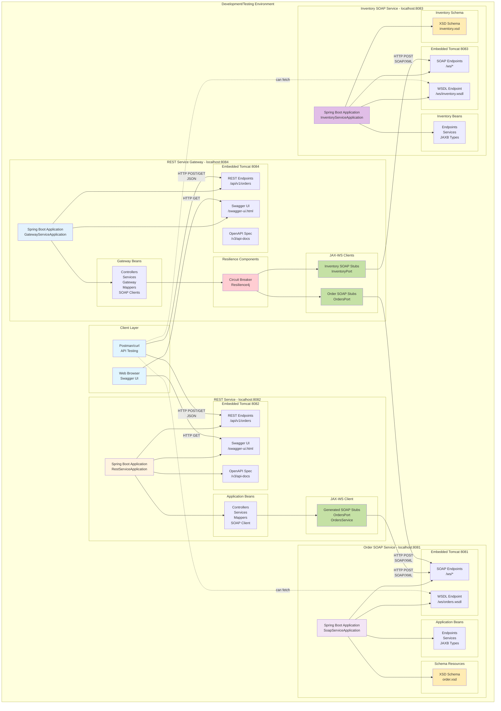
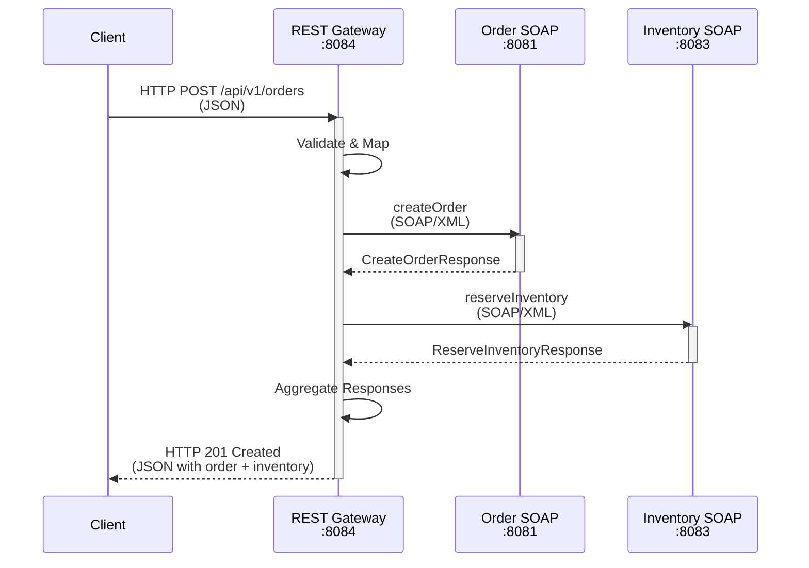
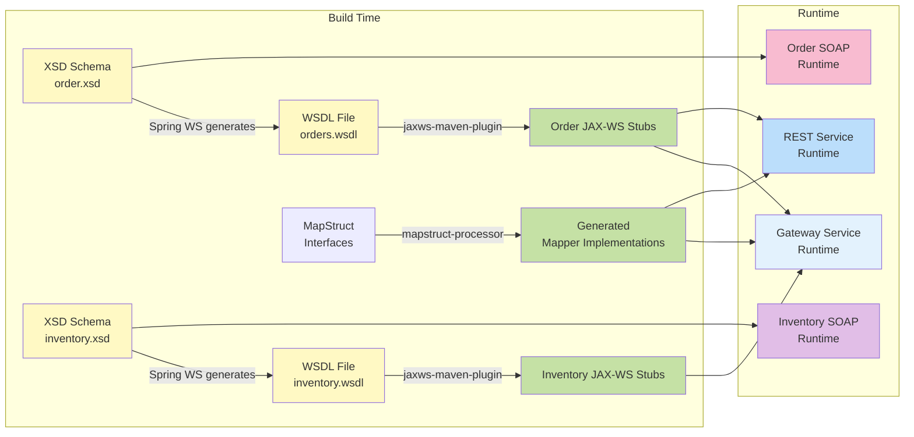
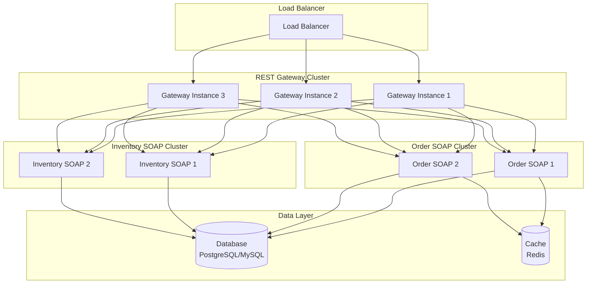

# Deployment Architecture

This diagram shows how the services are deployed and communicate at runtime.



## Deployment Details

### REST Service Gateway (Port 8084)

#### Runtime Environment
- **Framework**: Spring Boot 3.4.6
- **Web Server**: Embedded Tomcat
- **Port**: 8084
- **Context Path**: /

#### Exposed Endpoints
- `POST /api/v1/orders` - Create order with inventory reservation
- `POST /api/v1/orders/simple` - Create order without inventory
- `GET /swagger-ui.html` - Interactive API documentation
- `GET /v3/api-docs` - OpenAPI specification (JSON)

#### Dependencies
- **Order SOAP Service**: Connects to `http://localhost:8081/ws`
- **Inventory SOAP Service**: Connects to `http://localhost:8083/ws`
- **Configuration**: `soap.order-service.url` and `soap.inventory-service.url` in application.yml

#### Key Components
- Spring MVC for REST endpoints
- JAX-WS for SOAP clients (Order + Inventory)
- MapStruct for object mapping
- Resilience4j for circuit breaker and retry
- SpringDoc OpenAPI for documentation
- Jakarta Validation for request validation

### REST Service (Port 8082)

#### Runtime Environment
- **Framework**: Spring Boot 3.4.6
- **Web Server**: Embedded Tomcat
- **Port**: 8082
- **Context Path**: /

#### Exposed Endpoints
- `POST /api/v1/orders` - Create new order
- `GET /api/v1/orders/{orderId}` - Retrieve order
- `GET /swagger-ui.html` - Interactive API documentation
- `GET /v3/api-docs` - OpenAPI specification (JSON)
- `GET /v3/api-docs.yaml` - OpenAPI specification (YAML)

#### Dependencies
- **SOAP Service**: Connects to `http://localhost:8081/ws`
- **Configuration**: `soap.service.url` property in application.yml

#### Key Components
- Spring MVC for REST endpoints
- JAX-WS for SOAP client
- MapStruct for object mapping
- SpringDoc OpenAPI for documentation
- Jakarta Validation for request validation

### Order SOAP Service (Port 8081)

#### Runtime Environment
- **Framework**: Spring Boot 3.4.6
- **Web Server**: Embedded Tomcat
- **Port**: 8081
- **Context Path**: /

#### Exposed Endpoints
- `POST /ws` - SOAP endpoint for order operations
- `GET /ws/orders.wsdl` - WSDL definition (auto-generated)

#### SOAP Operations
- `createOrder` - Create order operation
- `getOrder` - Retrieve order operation

#### Data Storage
- In-memory storage using `ConcurrentHashMap`
- For demonstration purposes only
- Data lost on restart

#### Key Components
- Spring Web Services for SOAP endpoints
- JAXB for XML marshalling/unmarshalling
- XSD schema for contract definition

### Inventory SOAP Service (Port 8083)

#### Runtime Environment
- **Framework**: Spring Boot 3.4.6
- **Web Server**: Embedded Tomcat
- **Port**: 8083
- **Context Path**: /

#### Exposed Endpoints
- `POST /ws` - SOAP endpoint for inventory operations
- `GET /ws/inventory.wsdl` - WSDL definition (auto-generated)

#### SOAP Operations
- `checkInventory` - Check inventory availability for products
- `reserveInventory` - Reserve inventory for an order

#### Data Storage
- In-memory storage using `HashMap`
- Pre-populated with sample inventory data
- For demonstration purposes only

#### Key Components
- Spring Web Services for SOAP endpoints
- JAXB for XML marshalling/unmarshalling
- XSD schema for contract definition

## Communication Flow

### Simple Flow (REST Service)


### Gateway Flow (REST Gateway with Multiple SOAP Services)



## Network Configuration

### Local Development
```
┌─────────────────────────────────────────────────────────────┐
│                        localhost                             │
│                                                              │
│  ┌──────────┐    ┌──────────┐    ┌──────────┐              │
│  │  :8084   │───▶│  :8081   │    │  :8083   │◀───┐         │
│  │ Gateway  │    │  Order   │    │Inventory │    │         │
│  └──────────┘    │  SOAP    │    │  SOAP    │    │         │
│       │          └──────────┘    └──────────┘    │         │
│       └──────────────────────────────────────────┘         │
│                                                              │
│  ┌──────────┐    ┌──────────┐                               │
│  │  :8082   │───▶│  :8081   │                               │
│  │  REST    │    │  Order   │                               │
│  └──────────┘    │  SOAP    │                               │
│       ▲          └──────────┘                               │
│       │                                                      │
│  ┌────┴────┐                                                │
│  │ Client  │                                                │
│  └─────────┘                                                │
└─────────────────────────────────────────────────────────────┘
```

### Port Allocation
- **8081**: Order SOAP Service
- **8082**: REST Service (simple)
- **8083**: Inventory SOAP Service
- **8084**: REST Service Gateway (orchestrates multiple SOAP services)
- All services run on localhost in development

## Build and Runtime Process



### Build Steps

1. **Order SOAP Service Build**
   - XSD schema (`order.xsd`) loaded as resource
   - Spring WS generates WSDL at startup
   - JAXB generates classes from XSD (internal)

2. **Inventory SOAP Service Build**
   - XSD schema (`inventory.xsd`) loaded as resource
   - Spring WS generates WSDL at startup
   - JAXB generates classes from XSD (internal)
   
3. **REST Service Build**
   - Copy WSDL from Order SOAP service (manual step when schema changes)
   - `jaxws-maven-plugin` generates JAX-WS client stubs from WSDL
   - `mapstruct-processor` generates mapper implementations
   - Compile application code with generated classes

4. **REST Gateway Service Build**
   - Copy WSDLs from both SOAP services (Order + Inventory)
   - `jaxws-maven-plugin` generates JAX-WS client stubs from both WSDLs
   - `mapstruct-processor` generates mapper implementations
   - Compile application code with generated classes
    
5. **Packaging**
   - Each service packaged as standalone JAR
   - Includes all dependencies (fat JAR)
   - Can run with `java -jar`

## Starting the Services

### Order of Startup
1. **Start Order SOAP Service First** (Port 8081)
   ```bash
   cd soap-service
   mvn spring-boot:run
   ```

2. **Start Inventory SOAP Service** (Port 8083)
   ```bash
   cd inventory-soap-service
   mvn spring-boot:run
   ```

3. **Start REST Service** (Port 8082) - Optional
   ```bash
   cd rest-service
   mvn spring-boot:run
   ```

4. **Start REST Gateway Service** (Port 8084)
   ```bash
   cd rest-service-gateway
   mvn spring-boot:run
   ```

### Health Check
- Order SOAP Service: `curl http://localhost:8081/ws/orders.wsdl`
- Inventory SOAP Service: `curl http://localhost:8083/ws/inventory.wsdl`
- REST Service: `curl http://localhost:8082/v3/api-docs`
- REST Gateway Service: `curl http://localhost:8084/v3/api-docs`

## Production Considerations

### Potential Production Setup



### Production Enhancements Needed
1. **Replace In-Memory Storage**: Use PostgreSQL/MySQL database
2. **Add Caching**: Redis for frequently accessed data
3. **Service Discovery**: Use Consul/Eureka for dynamic service locations
4. **Load Balancing**: Distribute traffic across multiple instances
5. **Monitoring**: Add metrics, logging, tracing (Prometheus, ELK, Zipkin)
6. **Security**: Add authentication, authorization, TLS/SSL
7. **Configuration**: Externalize configuration (Spring Cloud Config)
8. **Resilience**: Circuit breakers and retry (already in Gateway with Resilience4j)
9. **Container Deployment**: Docker containers, Kubernetes orchestration
10. **API Gateway**: Already implemented with REST Gateway pattern

## Configuration Files

### REST Gateway Service - application.yml
```yaml
server:
  port: 8084

soap:
  order-service:
    url: http://localhost:8081/ws
  inventory-service:
    url: http://localhost:8083/ws

resilience4j:
  circuitbreaker:
    instances:
      orderService:
        slidingWindowSize: 10
        failureRateThreshold: 50
      inventoryService:
        slidingWindowSize: 10
        failureRateThreshold: 50
  retry:
    instances:
      orderService:
        maxAttempts: 3
        waitDuration: 1s
      inventoryService:
        maxAttempts: 3
        waitDuration: 1s

springdoc:
  api-docs:
    path: /v3/api-docs
  swagger-ui:
    path: /swagger-ui.html
```

### REST Service - application.yml
```yaml
server:
  port: 8082

soap:
  service:
    url: http://localhost:8081/ws

springdoc:
  api-docs:
    path: /v3/api-docs
  swagger-ui:
    path: /swagger-ui.html
```

### Order SOAP Service - application.yml
```yaml
server:
  port: 8081

spring:
  ws:
    path: /ws
```

### Inventory SOAP Service - application.yml
```yaml
server:
  port: 8083

spring:
  ws:
    path: /ws
```

## Monitoring Endpoints

### Actuator Endpoints (If Enabled)
- `/actuator/health` - Health check
- `/actuator/metrics` - Metrics
- `/actuator/info` - Application info
- `/actuator/env` - Environment properties

### Custom Monitoring
- Track request/response times
- Monitor SOAP call success/failure rates
- Log mapping exceptions
- Track API usage patterns
- Monitor circuit breaker states (Gateway)
