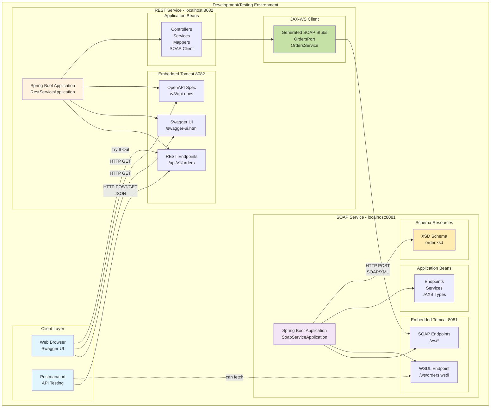
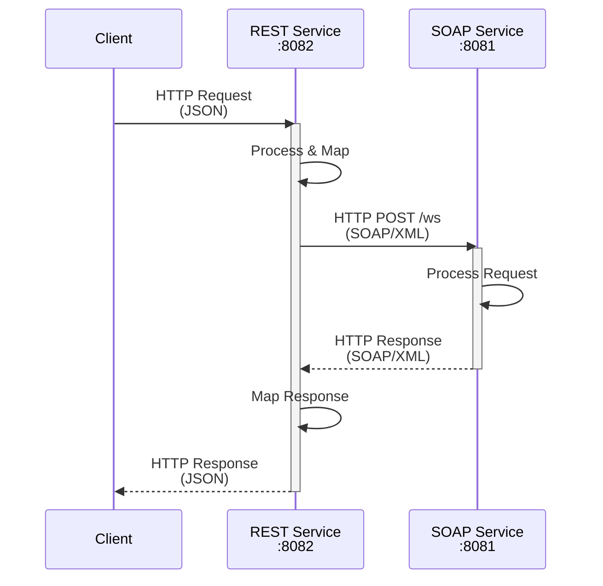
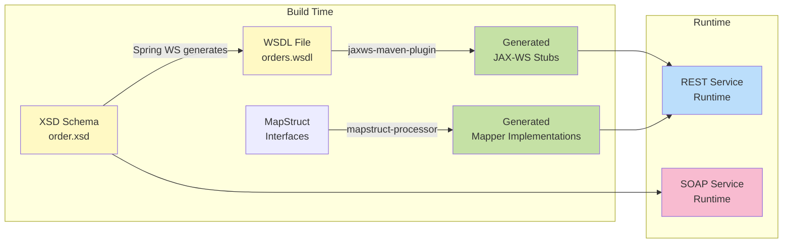
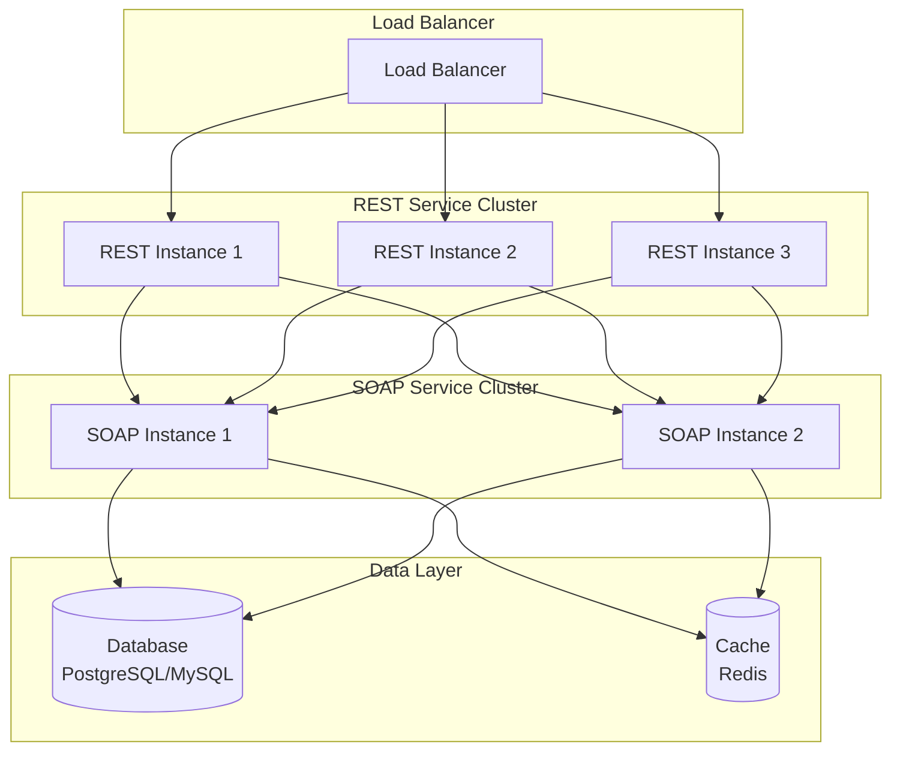

# Deployment Architecture

This diagram shows how the services are deployed and communicate at runtime.



## Deployment Details

### REST Service (Port 8082)

#### Runtime Environment
- **Framework**: Spring Boot 3.4.6
- **Web Server**: Embedded Tomcat
- **Port**: 8082
- **Context Path**: /

#### Exposed Endpoints
- `POST /api/v1/orders` - Create new order
- `GET /api/v1/orders/{orderId}` - Retrieve order
- `GET /swagger-ui.html` - Interactive API documentation
- `GET /v3/api-docs` - OpenAPI specification (JSON)
- `GET /v3/api-docs.yaml` - OpenAPI specification (YAML)

#### Dependencies
- **SOAP Service**: Connects to `http://localhost:8081/ws`
- **Configuration**: `soap.service.url` property in application.yml

#### Key Components
- Spring MVC for REST endpoints
- JAX-WS for SOAP client
- MapStruct for object mapping
- SpringDoc OpenAPI for documentation
- Jakarta Validation for request validation

### SOAP Service (Port 8081)

#### Runtime Environment
- **Framework**: Spring Boot 3.4.6
- **Web Server**: Embedded Tomcat
- **Port**: 8081
- **Context Path**: /

#### Exposed Endpoints
- `POST /ws` - SOAP endpoint for order operations
- `GET /ws/orders.wsdl` - WSDL definition (auto-generated)

#### SOAP Operations
- `createOrder` - Create order operation
- `getOrder` - Retrieve order operation

#### Data Storage
- In-memory storage using `ConcurrentHashMap`
- For demonstration purposes only
- Data lost on restart

#### Key Components
- Spring Web Services for SOAP endpoints
- JAXB for XML marshalling/unmarshalling
- XSD schema for contract definition

## Communication Flow



## Network Configuration

### Local Development
```
┌─────────────────────────────────────┐
│          localhost                  │
│                                     │
│  ┌──────────┐      ┌──────────┐   │
│  │  :8082   │─────▶│  :8081   │   │
│  │  REST    │      │  SOAP    │   │
│  └──────────┘      └──────────┘   │
│       ▲                             │
│       │                             │
│  ┌────┴────┐                       │
│  │ Client  │                       │
│  └─────────┘                       │
└─────────────────────────────────────┘
```

### Port Allocation
- **8081**: SOAP Service
- **8082**: REST Service
- Both services run on localhost in development

## Build and Runtime Process



### Build Steps

1. **SOAP Service Build**
   - XSD schema loaded as resource
   - Spring WS generates WSDL at startup
   - JAXB generates classes from XSD (internal)
   
2. **REST Service Build**
   - Copy WSDL from SOAP service (manual step when schema changes)
   - `jaxws-maven-plugin` generates JAX-WS client stubs from WSDL
   - `mapstruct-processor` generates mapper implementations
   - Compile application code with generated classes
   
3. **Packaging**
   - Each service packaged as standalone JAR
   - Includes all dependencies (fat JAR)
   - Can run with `java -jar`

## Starting the Services

### Order of Startup
1. **Start SOAP Service First** (Port 8081)
   ```bash
   cd soap-service
   mvn spring-boot:run
   ```

2. **Start REST Service Second** (Port 8082)
   ```bash
   cd rest-service
   mvn spring-boot:run
   ```

### Health Check
- SOAP Service: `curl http://localhost:8081/ws/orders.wsdl`
- REST Service: `curl http://localhost:8082/v3/api-docs`

## Production Considerations

### Potential Production Setup



### Production Enhancements Needed
1. **Replace In-Memory Storage**: Use PostgreSQL/MySQL database
2. **Add Caching**: Redis for frequently accessed data
3. **Service Discovery**: Use Consul/Eureka for dynamic service locations
4. **Load Balancing**: Distribute traffic across multiple instances
5. **Monitoring**: Add metrics, logging, tracing (Prometheus, ELK, Zipkin)
6. **Security**: Add authentication, authorization, TLS/SSL
7. **Configuration**: Externalize configuration (Spring Cloud Config)
8. **Resilience**: Add circuit breakers, retry logic, timeouts
9. **Container Deployment**: Docker containers, Kubernetes orchestration
10. **API Gateway**: Add API gateway for rate limiting, routing

## Configuration Files

### REST Service - application.yml
```yaml
server:
  port: 8082

soap:
  service:
    url: http://localhost:8081/ws

springdoc:
  api-docs:
    path: /v3/api-docs
  swagger-ui:
    path: /swagger-ui.html
```

### SOAP Service - application.yml
```yaml
server:
  port: 8081

spring:
  ws:
    path: /ws
```

## Monitoring Endpoints

### Actuator Endpoints (If Enabled)
- `/actuator/health` - Health check
- `/actuator/metrics` - Metrics
- `/actuator/info` - Application info
- `/actuator/env` - Environment properties

### Custom Monitoring
- Track request/response times
- Monitor SOAP call success/failure rates
- Log mapping exceptions
- Track API usage patterns
