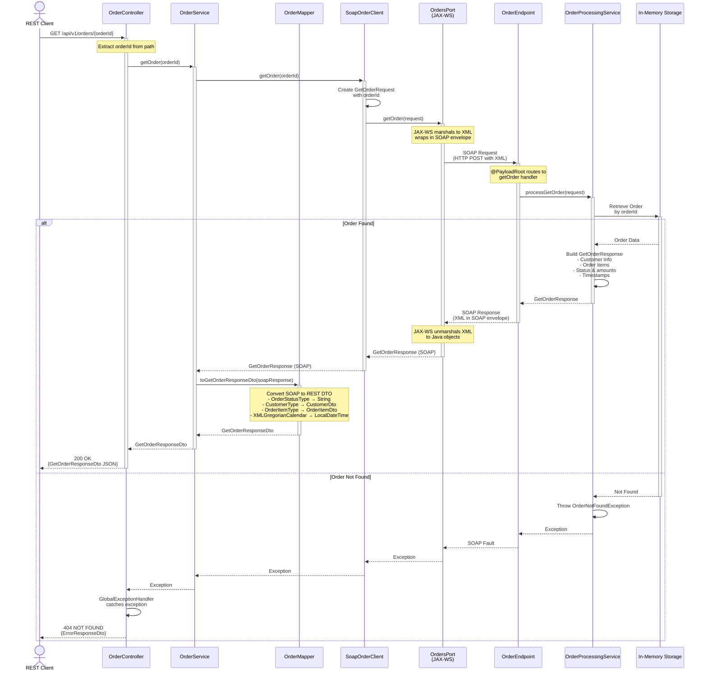

# Get Order Sequence Diagram

This diagram illustrates the flow when a client retrieves an existing order through the REST API.



## Flow Steps Explained

### 1. Client Request
- Client sends HTTP GET request with order ID in path parameter
- No request body required

### 2. Controller Layer
- **OrderController** receives the request
- Extracts `orderId` from path variable using `@PathVariable`
- Delegates to **OrderService**

### 3. Service Layer
- **OrderService** calls **SoapOrderClient** with the order ID
- No DTO conversion needed for request (simple string parameter)

### 4. SOAP Client
- **SoapOrderClient** creates a `GetOrderRequest` object
- Sets the order ID on the request
- Calls **OrdersPort** to make the SOAP call

### 5. JAX-WS Communication
- **OrdersPort** marshals the request to XML
- Wraps in SOAP envelope and sends via HTTP POST
- Sends to SOAP service endpoint

### 6. SOAP Service
- **OrderEndpoint** receives the request
- Routes to `getOrder` handler via `@PayloadRoot`
- Delegates to **OrderProcessingService**

### 7. Business Logic - Success Case
- **OrderProcessingService** retrieves order from storage
- Builds comprehensive `GetOrderResponse` with:
  - Order ID
  - Complete customer information
  - List of order items
  - Order status and total amount
  - Notes (if any)
  - Creation and update timestamps
- Returns response through the chain

### 8. Business Logic - Not Found Case
- If order not found in storage:
  - Throws `OrderNotFoundException`
  - Propagates through SOAP fault mechanism
  - Caught by **GlobalExceptionHandler**
  - Returns 404 NOT FOUND with error details

### 9. Response Mapping
- For successful responses:
  - **OrderMapper** converts SOAP types to REST DTOs
  - Handles complex nested objects (Customer, Items, Address)
  - Converts XML date types to Java 8 date/time types
  - Returns clean REST DTO

### 10. Client Response
- **OrderController** returns appropriate HTTP status
- 200 OK with order details (success)
- 404 NOT FOUND with error message (not found)

## Data Transformations

### Request Path
```
orderId (String) → GetOrderRequest (SOAP) → XML
```

### Response Path (Success)
```
XML → GetOrderResponse (SOAP) → GetOrderResponseDto → REST JSON
```

### Response Path (Error)
```
Exception → SOAP Fault → Exception → ErrorResponseDto → REST JSON
```

## Key Differences from Create Order

1. **Simpler Request**: Only order ID needed, no complex DTO mapping
2. **Read Operation**: No data modification, pure retrieval
3. **Error Scenarios**: Handles "not found" case explicitly
4. **Response Size**: Larger response with complete order details

## Error Handling

- **OrderNotFoundException**: Thrown when order doesn't exist
- **GlobalExceptionHandler**: Converts exceptions to appropriate HTTP responses
- **SOAP Faults**: Properly propagated from SOAP service to REST client
- **HTTP Status Codes**: 
  - 200 OK: Order found and returned
  - 404 NOT FOUND: Order doesn't exist
  - 500 Internal Server Error: Other errors
