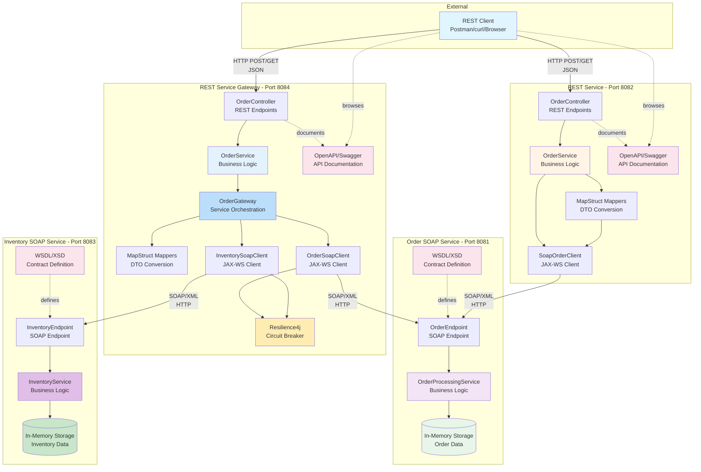

# System Architecture

This diagram shows the high-level architecture of the REST to SOAP integration demo application.

## Key Components

### REST Service Gateway Layer (Port 8084)
- **OrderController**: Exposes REST API endpoints for order operations with inventory
- **OrderService**: Contains business logic and orchestrates the flow
- **OrderGateway**: Orchestrates calls to multiple SOAP backend services
- **MapStruct Mappers**: Converts between REST DTOs and SOAP types
- **OrderSoapClient**: JAX-WS client for communicating with Order SOAP service
- **InventorySoapClient**: JAX-WS client for communicating with Inventory SOAP service
- **Resilience4j**: Circuit breaker and retry patterns for resilience
- **OpenAPI**: Provides interactive API documentation via Swagger UI

### REST Service Layer (Port 8082)
- **OrderController**: Exposes REST API endpoints for order operations
- **OrderService**: Contains business logic and orchestrates the flow
- **MapStruct Mappers**: Converts between REST DTOs and SOAP types
- **SoapOrderClient**: JAX-WS client for communicating with SOAP service
- **OpenAPI**: Provides interactive API documentation via Swagger UI

### Order SOAP Service Layer (Port 8081)
- **OrderEndpoint**: Handles incoming SOAP requests for orders
- **OrderProcessingService**: Processes orders and manages data
- **WSDL/XSD**: Contract-first definition of the service
- **In-Memory Storage**: Simulates data persistence for demo purposes

### Inventory SOAP Service Layer (Port 8083)
- **InventoryEndpoint**: Handles incoming SOAP requests for inventory
- **InventoryService**: Manages inventory checking and reservation
- **WSDL/XSD**: Contract-first definition of the inventory service
- **In-Memory Storage**: Simulates inventory data persistence

## Communication Flow

### Simple Flow (REST Service → Order SOAP Service)
1. **REST Client** sends HTTP requests with JSON payloads to REST Service (8082)
2. **REST Service** validates and processes the requests
3. **MapStruct** converts REST DTOs to SOAP objects
4. **SOAP Client** sends SOAP/XML requests to Order SOAP Service
5. **SOAP Service** processes requests and returns responses
6. **MapStruct** converts SOAP responses back to REST DTOs
7. **REST Service** returns JSON responses to client

### Gateway Flow (REST Gateway → Multiple SOAP Services)
1. **REST Client** sends HTTP requests with JSON payloads to REST Gateway (8084)
2. **Gateway Controller** delegates to OrderService
3. **OrderGateway** orchestrates calls to multiple backend services:
   - Creates order via Order SOAP Service (8081)
   - Reserves inventory via Inventory SOAP Service (8083)
4. **Resilience4j** provides circuit breaker and retry for SOAP calls
5. **Gateway** aggregates responses from multiple services
6. **REST Gateway** returns unified JSON response to client
