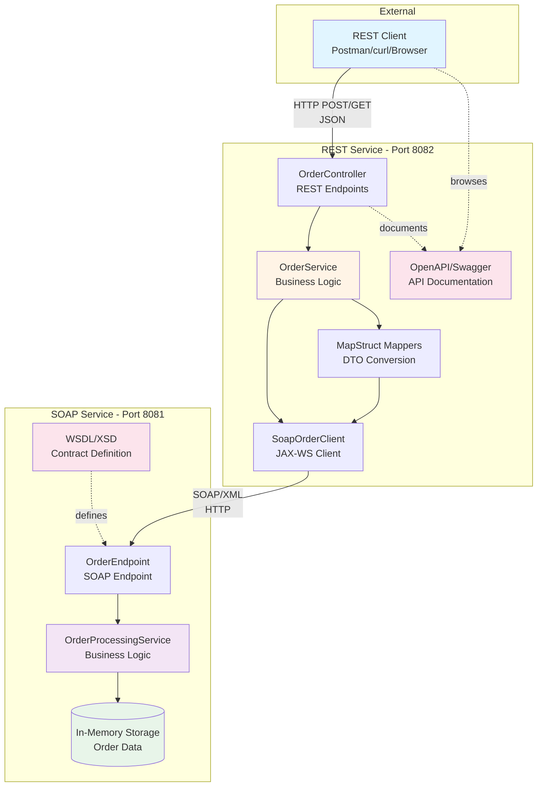

# System Architecture

This diagram shows the high-level architecture of the REST to SOAP integration demo application.

## Key Components

### REST Service Layer
- **OrderController**: Exposes REST API endpoints for order operations
- **OrderService**: Contains business logic and orchestrates the flow
- **MapStruct Mappers**: Converts between REST DTOs and SOAP types
- **SoapOrderClient**: JAX-WS client for communicating with SOAP service
- **OpenAPI**: Provides interactive API documentation via Swagger UI

### SOAP Service Layer
- **OrderEndpoint**: Handles incoming SOAP requests
- **OrderProcessingService**: Processes orders and manages data
- **WSDL/XSD**: Contract-first definition of the service
- **In-Memory Storage**: Simulates data persistence for demo purposes

## Communication Flow

1. **REST Client** sends HTTP requests with JSON payloads
2. **REST Service** validates and processes the requests
3. **MapStruct** converts REST DTOs to SOAP objects
4. **SOAP Client** sends SOAP/XML requests to SOAP Service
5. **SOAP Service** processes requests and returns responses
6. **MapStruct** converts SOAP responses back to REST DTOs
7. **REST Service** returns JSON responses to client
