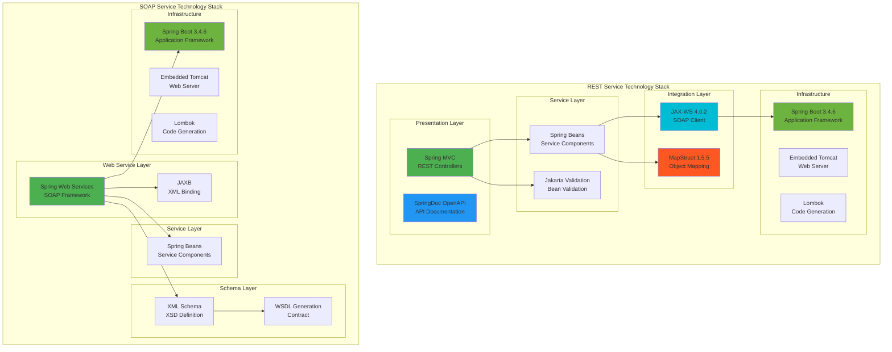
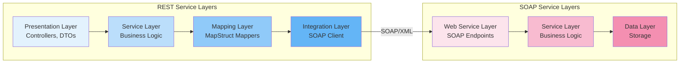
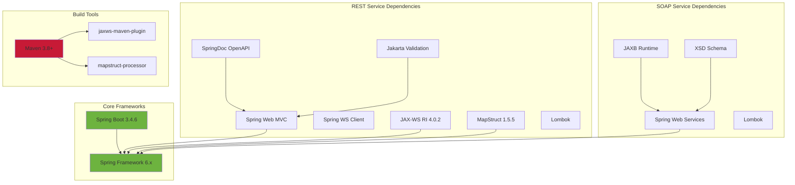
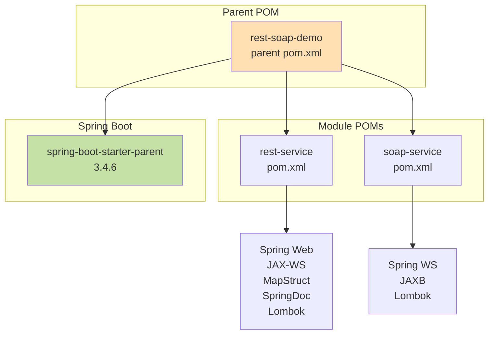
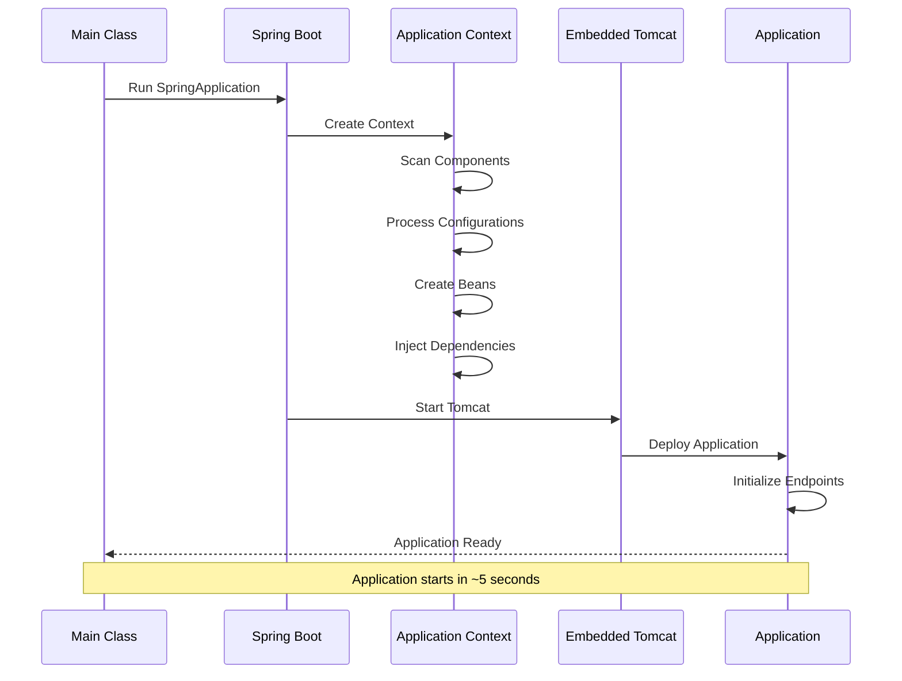

# Technology Stack and Layers

This diagram shows the technology stack and architectural layers of the application.

## Technology Stack Overview



## Architectural Layers



## Framework Dependencies



## Code Generation Flow

```mermaid
graph LR
    subgraph "Build Time Generation"
        XSD[order.xsd<br/>Schema Definition]
        WSDL[orders.wsdl<br/>Service Contract]
        MapperIFs[Mapper Interfaces<br/>@Mapper annotated]
        
        XSD -->|Spring WS| WSDLGen[Generated WSDL<br/>at runtime]
        WSDL -->|jaxws-maven-plugin| JAXWSGen[JAX-WS Stubs<br/>OrdersPort, Types]
        MapperIFs -->|mapstruct-processor| MapperImpl[Mapper Implementations<br/>Generated Classes]
        XSD -->|JAXB| JAXBGen[JAXB Classes<br/>for SOAP Service]
    end
    
    subgraph "Compile Time"
        JAXWSGen --> Compilation[Java Compilation]
        MapperImpl --> Compilation
        JAXBGen --> Compilation
    end
    
    subgraph "Runtime"
        Compilation --> JARFile[Executable JAR]
        WSDLGen --> Runtime[Spring Boot Runtime]
        JARFile --> Runtime
    end
    
    style XSD fill:#FFF9C4
    style WSDL fill:#FFF9C4
    style JAXWSGen fill:#C5E1A5
    style MapperImpl fill:#C5E1A5
    style JAXBGen fill:#C5E1A5
    style Runtime fill:#BBDEFB
```

## Dependency Management



## Technology Versions

| Technology | Version | Purpose |
|------------|---------|---------|
| Java | 17+ | Programming language |
| Spring Boot | 3.4.6 | Application framework |
| Spring Web MVC | 6.x | REST controller framework |
| Spring Web Services | 4.x | SOAP service framework |
| JAX-WS RI | 4.0.2 | SOAP client implementation |
| JAXB | 4.x | XML/Java binding |
| MapStruct | 1.5.5 | Object mapping |
| SpringDoc OpenAPI | 2.8.4 | API documentation |
| Jakarta Validation | 3.x | Bean validation |
| Lombok | 1.18.30 | Boilerplate reduction |
| Maven | 3.8+ | Build tool |

## Technology Choices Rationale

### Spring Boot 3.4.6
- ✅ Latest stable version
- ✅ Jakarta EE 10 support
- ✅ Improved performance
- ✅ Better observability
- ✅ Native compilation support

### JAX-WS 4.0.2
- ✅ Jakarta XML Web Services (Jakarta EE 10)
- ✅ Type-safe SOAP client
- ✅ WSDL-first native support
- ✅ Industry standard
- ✅ Better tooling

### MapStruct 1.5.5
- ✅ Compile-time code generation
- ✅ Zero runtime overhead
- ✅ Type-safe mappings
- ✅ IDE-friendly
- ✅ Excellent Spring integration

### Spring Web Services
- ✅ Contract-first approach
- ✅ Spring integration
- ✅ WSDL auto-generation
- ✅ Comprehensive features
- ✅ Production-ready

### SpringDoc OpenAPI
- ✅ OpenAPI 3.0 support
- ✅ Automatic spec generation
- ✅ Swagger UI integration
- ✅ Spring Boot 3 compatible
- ✅ Rich annotations

## Integration Patterns Used

### 1. API Gateway Pattern (REST as Gateway)
```
Client → REST API → SOAP Service
```
REST service acts as a modern gateway to legacy SOAP service.

### 2. Adapter Pattern (MapStruct Mappers)
```
REST DTO ← Mapper → SOAP Types
```
Adapters convert between different object models.

### 3. Proxy Pattern (JAX-WS Client)
```
Business Logic → JAX-WS Proxy → SOAP Endpoint
```
Proxy handles remote communication transparently.

### 4. Facade Pattern (Service Layer)
```
Controller → Service Facade → Multiple Components
```
Service provides simplified interface to complex subsystems.

### 5. Contract-First Pattern (WSDL/XSD)
```
XSD Schema → Generated Code → Implementation
```
Contract defines the interface, code is generated.

## Build Lifecycle

```mermaid
graph LR
    A[mvn clean] --> B[Delete target/]
    B --> C[mvn generate-sources]
    C --> D[Generate JAX-WS Stubs]
    D --> E[mvn compile]
    E --> F[Process MapStruct]
    F --> G[Compile Java]
    G --> H[mvn test]
    H --> I[Run Tests]
    I --> J[mvn package]
    J --> K[Create JAR]
    K --> L[mvn install]
    L --> M[Install to local repo]
    
    style A fill:#FFCDD2
    style K fill:#C8E6C9
    style M fill:#C8E6C9
```



## Runtime Startup Sequence



## Performance Characteristics

### REST Service
- **Startup Time**: ~5-7 seconds
- **Memory**: ~200-300 MB
- **Response Time**: <100ms (excluding SOAP call)
- **Throughput**: Limited by SOAP service

### SOAP Service
- **Startup Time**: ~3-5 seconds
- **Memory**: ~150-250 MB
- **Response Time**: ~50ms (in-memory storage)
- **Throughput**: High (in-memory operations)

### Mapping Overhead
- **MapStruct**: Negligible (~1-2ms)
- **JAXB Marshalling**: ~5-10ms
- **JAX-WS Overhead**: ~10-20ms

Total overhead for REST→SOAP→REST: ~20-30ms

## Scalability Considerations

### Horizontal Scaling
- ✅ Both services are stateless
- ✅ Can run multiple instances
- ✅ Use load balancer for distribution
- ⚠️ SOAP service needs shared database

### Vertical Scaling
- ✅ JVM tuning options available
- ✅ Connection pool sizing
- ✅ Thread pool configuration
- ✅ Memory optimization

### Bottlenecks
- 🔴 In-memory storage (SOAP service)
- 🟡 XML marshalling/unmarshalling
- 🟡 HTTP communication overhead
- 🟢 MapStruct mapping (minimal)

## Security Considerations

### Current Implementation (Demo)
- ❌ No authentication
- ❌ No authorization
- ❌ No encryption (HTTP)
- ❌ No input sanitization

### Production Requirements
- ✅ Add OAuth2/JWT authentication
- ✅ Add role-based authorization
- ✅ Use HTTPS/TLS
- ✅ Add input validation
- ✅ Add rate limiting
- ✅ Add CORS configuration
- ✅ Add security headers
